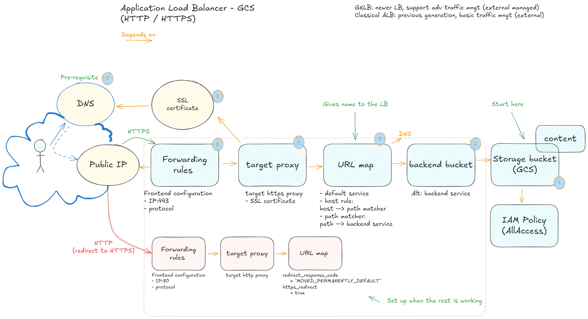

# GCS exposed by  a load balancer in Terraform
The load balancer is a central piece of the software defined network in Google Cloud. It's composed of many components. This repo shows how to install an external load balancer with a GCS bucket as the backend with Terraform.  

The main reason is understanding and keeping control of each component which gets hidden in some modules.  

Google Cloud has extensive documentation  on how to design your infrastructure in GCP. The [architecture framework](https://docs.cloud.google.com/architecture/framework) is a good place to start.  
There is a large repository of [Terraform  blueprints](https://docs.cloud.google.com/docs/terraform/blueprints/terraform-blueprints), specifically this module for the [load balancer](https://github.com/terraform-google-modules/terraform-google-lb)  

## Overview over  resources to build   
.

## Prerequisites

- Access to a Google Cloud project with billing enabled and enough permissions to enable resources
- Running scripts: Google Cloud Shell is an easy way to run test terraform with both gcloud, and terraform available
- basic knowledge of terraform

* We create a Public IP and public  SSL-certificate in the start of the terraform script. Refer to documentation if you want to use your own.  
Note: the public IP must be in the same project that the LB (can be moved from another project if necessary).  
See at the end of the readme for terraform examples to create a managed DNS zone, with sub domains linked to an IP

## setup your environment

* terraform resources are defined in infra/
* You should be able to run each numbered element one by one if you want to.
* set your project ID and  project number in the  config.tf file or use the terraform.tf
* `terraform init`
* `terraform plan` to see what will be created and `terraform apply` to create the actual infrastructure.
You must authenticate when running outside of Cloud Shell: `gcloud auth login` and `gcloud auth application-default login`  

Navigate the Cloud Console to explore the different components  illustrated over.


## setup your network resources 

It may be an idea to have a dedicated project to manage some of the network resources like DNS.  
Note that some of these resources like the SSL certificate take time to create.  
If you are managing a lot of sites, look at the Google [Cloud Certificate manager](https://docs.cloud.google.com/certificate-manager/docs/overview).  

### Enable APIs

```sh
resource "google_project_service" "gcp_services" {
  project = var.project_id
  for_each = toset([
    "dns.googleapis.com",
    "compute.googleapis.com",
  ])
  service            = each.key
  disable_on_destroy = false
}
```
### Create the Cloud DNS resources

The second resource is not strictly  required. a TXT entry make it easy to test.

```sh
resource "google_dns_managed_zone" "demo-zone" {
  project     = local.project_id
  name        = "demo-dns-zone"
  dns_name    =  <your domain here>
  description = "Demo DNS zone "
  visibility  = "public"

  dnssec_config {
    state = "off"
  }

  # off by default, here for reference and explicit
  #cloud_logging_config {
  #  enable_logging = false
  #}

  depends_on = [google_project_service.gcp_services]
}

# TTL set low to get quick feedback when testing
# test with f
# dig test.<your-domain> TXT +short
resource "google_dns_record_set" "txt-demo" {
  project      = local.project_id
  name         = "demo.${google_dns_managed_zone.demo-zone.dns_name}"
  managed_zone = google_dns_managed_zone.demo-zone.name
  type         = "TXT"
  ttl          = 60

  rrdatas    = ["\"hello from demo\""]
  depends_on = [google_dns_managed_zone.demo-zone]
}
```
### create  SSL certificate, the public IP and the DNS record for it

```sh

data "google_compute_global_address" "demo-ip" {
  name       = "demo-ip"
  project    = <the project where the IP is created>
  depends_on = [google_project_service.gcp_services["compute.googleapis.com"]]
}


resource "google_dns_record_set" "a_demo" {
  project      = local.project_id
  name         = "demo.${google_dns_managed_zone.demo-zone.dns_name}"
  managed_zone = google_dns_managed_zone.demo-zone.name
  type         = "A"
  ttl          = 300

  rrdatas = [data.google_compute_global_address.demo-ip.address]
  depends_on = [
    google_dns_managed_zone.demo-zone,
    google_project_service.gcp_services["dns.googleapis.com"],
    data.google_compute_global_address.demo-ip
  ]
}

```
