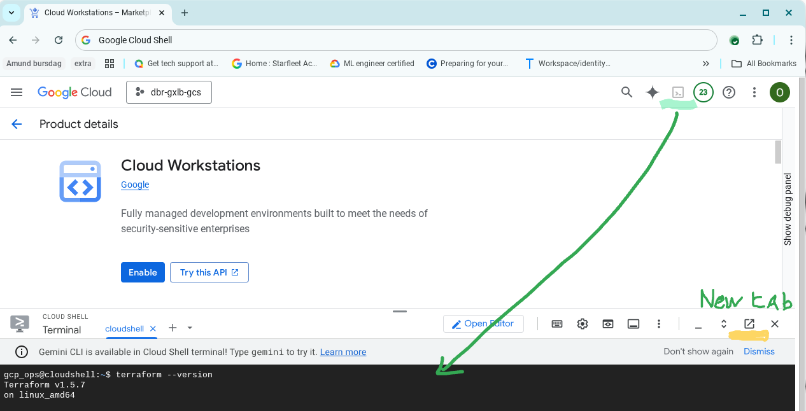

# GCS exposed by  a load balancer in Terraform

The goal of this repo is to use terraform to install an external load balancer with a GCS bucket as the backend.   The main reason is learning and understanding each components  
Google Cloud has extensive documentation  on how to design your infrastructure in GCP. The https://docs.cloud.google.com/architecture/framework is a good place to start.  
There is a large repository of teTerraform  blueprints available at https://docs.cloud.google.com/docs/terraform/blueprints/terraform-blueprints  
Specifically for the load balancer :  https://github.com/terraform-google-modules/terraform-google-lb  

## Overview over  resources to build   
.

## Prerequisites

- Access to a Google Cloud project with billing enabled and enough permissions to enable resources
- Running scripts: Google Cloud Shell is an easy way to run test terraform with both gcloud, and terraform available
- basic knowledge of terraform

## setup your environment
Note: hardcoded values should be managed with  envirronments variables , terraform.tfvars or other solutions.

* teeraform resources defined in infra/
* set you project ID and  project number in the  config.tf file
* `terraform init`
* `terraform plan` to see what will be created and `terraform apply` to create the actual infrastructure.

